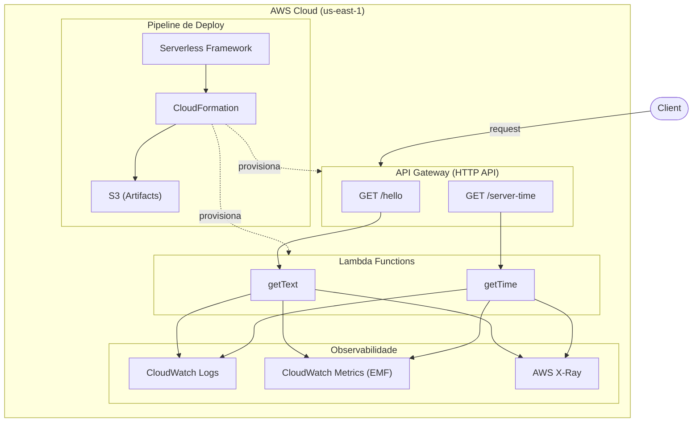

# Arquitetura — Serverless API

O diagrama mostra o fluxo completo: **Client → API Gateway** (com as 2 rotas) → **Lambdas** (getText e getTime) → os 3 pilares de observabilidade (**CloudWatch Logs**, **CloudWatch Metrics** via EMF, e **X-Ray tracing**), e na parte inferior o pipeline de deploy (**Serverless Framework → CloudFormation → S3**).

